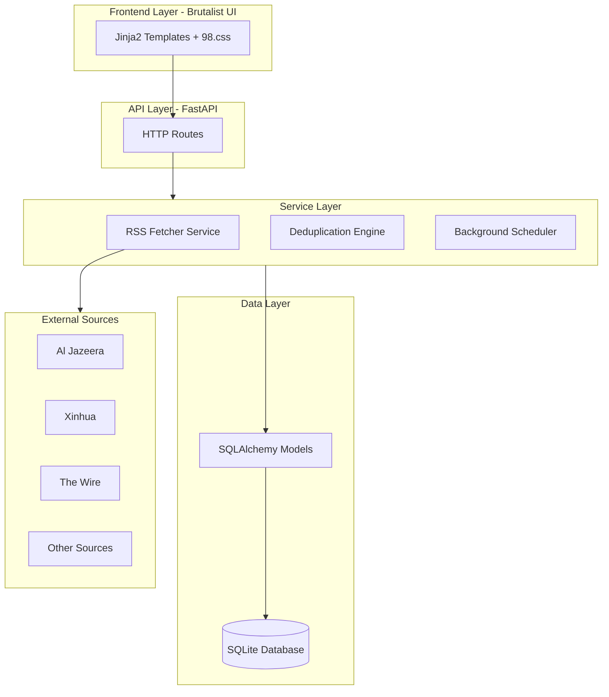

# RetroAgg

A **global news aggregator** prioritizing information pluralism and breaking content bubbles through diverse international sources.


## Philosophy

RetroAgg represents a rebellion against the algorithmic curation and Western-centric bias of modern news platforms. By prioritizing **non-Western perspectives**, it offers:

- **No algorithms** - Chronological feeds only, no personalization
- **No tracking** - Your reading habits stay private
- **High information density** - Maximum content, minimum bloat
- **Global pluralism** - Sources from Asia, Africa, MENA, Latin America, and the Global South

## Features

### Core Functionality
- **RSS Aggregation** - Async fetching from 15+ diverse global sources
- **Auto-deduplication** - Content hashing + headline similarity (70% threshold)
- **Background Updates** - Automatic feed refresh every 15 minutes
- **Regional Filtering** - Filter by geographic region
- **Source Transparency** - Bias indicators and region tags
- **Dark/Light Theme** - Toggle between dark and light modes

### Tech Stack
- **Backend**: FastAPI (Python) with async support
- **Database**: SQLite with SQLAlchemy ORM
- **Frontend**: Jinja2 templates with custom CSS
- **Scheduling**: APScheduler for background tasks
- **RSS Parsing**: feedparser + httpx for async HTTP

### Aesthetic
- **Modern clean design** - Dark and light theme support
- **Inter font** - Modern, readable typography
- **Responsive layout** - Works on all screen sizes
- **Accessible** - High contrast, keyboard navigation

## Installation

### Prerequisites
- Python 3.11+
- pip

### Setup

1. **Clone the repository**
```bash
git clone <repository-url>
cd retroagg
```

2. **Create virtual environment**
```bash
python -m venv venv
source venv/bin/activate  # Linux/Mac
# or
venv\Scripts\activate  # Windows
```

3. **Install dependencies**
```bash
pip install -r requirements.txt
```

4. **Initialize the database**
```bash
cd app
python init_db.py
```

5. **Run the application**
```bash
python main.py
```

Or with uvicorn directly:
```bash
uvicorn app.main:app --reload --host 0.0.0.0 --port 8000
```

6. **Open your browser**
```
http://localhost:8000
```

## Usage

### Web Interface
- **Home** (`/`) - Article feed with region/source filters
- **Sources** (`/sources`) - Complete source registry by region
- **API Docs** (`/api/docs`) - Interactive Swagger documentation

### API Endpoints

| Endpoint | Method | Description |
|----------|--------|-------------|
| `/api/articles` | GET | Get articles (with region/source filters) |
| `/api/sources` | GET | List all configured sources |
| `/api/refresh` | POST | Manually trigger RSS refresh |
| `/api/stats` | GET | Get basic statistics |
| `/health` | GET | Health check |

### Query Parameters

**`/api/articles`**
- `region` - Filter by region (Asia, Africa, MENA, Europe, Americas, Global)
- `source_id` - Filter by source ID
- `include_duplicates` - Include duplicate articles (default: false)
- `page` - Page number (default: 1)
- `page_size` - Items per page (default: 50)

## Source Registry

RetroAgg prioritizes diverse perspectives:

### MENA (Middle East & North Africa)
- Al Jazeera (Qatar) - Arab perspective on global affairs
- Haaretz (Israel) - Israeli liberal viewpoint
- Middle East Eye - Independent Middle East coverage

### Asia
- South China Morning Post (Hong Kong)
- Kyodo News (Japan)
- The Wire (India) - Independent investigative journalism
- The Diplomat - Asia-Pacific politics

### Africa
- Mail & Guardian (South Africa)
- The Africa Report
- African Arguments

### Latin America
- Americas Quarterly
- Buenos Aires Times

### Global South
- Inter Press Service - Developing nation perspective
- Global Voices - Citizen media worldwide

### Baseline
- Reuters - Neutral wire service for comparison
- Deutsche Welle - German public broadcaster

## Configuration

Edit `app/config.py` to customize:

```python
FETCH_INTERVAL_MINUTES = 15  # Background fetch interval
REQUEST_TIMEOUT = 30         # HTTP timeout
MAX_RETRIES = 3             # Retry attempts for failed fetches
DUPLICATE_THRESHOLD = 0.70   # Headline similarity threshold
PAGE_SIZE = 50              # Articles per page
```

## Project Structure

```
retroagg/
├── app/
│   ├── models/          # SQLAlchemy models
│   ├── services/        # RSS fetcher, deduplicator
│   ├── routers/         # API and page routes
│   ├── schemas/         # Pydantic schemas
│   ├── templates/       # Jinja2 templates
│   ├── static/          # Static assets
│   ├── config.py        # Application settings
│   ├── database.py      # Database setup
│   ├── scheduler.py     # Background tasks
│   ├── init_db.py       # Database initialization
│   └── main.py          # FastAPI application
├── data/                # SQLite database
├── plans/               # Architecture documentation
├── requirements.txt
└── README.md
```

## Architecture



## Future Enhancements

- [ ] AI-powered semantic extraction (ScrapeGraphAI)
- [ ] Vector search with embeddings
- [ ] LLM summarization
- [ ] Sentiment analysis
- [ ] ActivityPub/Fediverse integration
- [ ] Nostr protocol support
- [ ] Proxy layer for geo-unblocking

## Legal/Ethical Considerations

- Only headlines and summaries are stored (Fair Use)
- All articles link to original sources
- No user tracking or profiling
- Transparent source attribution
- Respect for robots.txt and rate limits

## License

MIT License - See LICENSE file for details

## Acknowledgments

- [98.css](https://jdan.github.io/98.css/) - Windows 98 CSS framework
- [FastAPI](https://fastapi.tiangolo.com/) - Modern Python web framework
- [SQLAlchemy](https://www.sqlalchemy.org/) - SQL toolkit and ORM

---

**RetroAgg** - *Breaking the content bubble, one feed at a time.*
