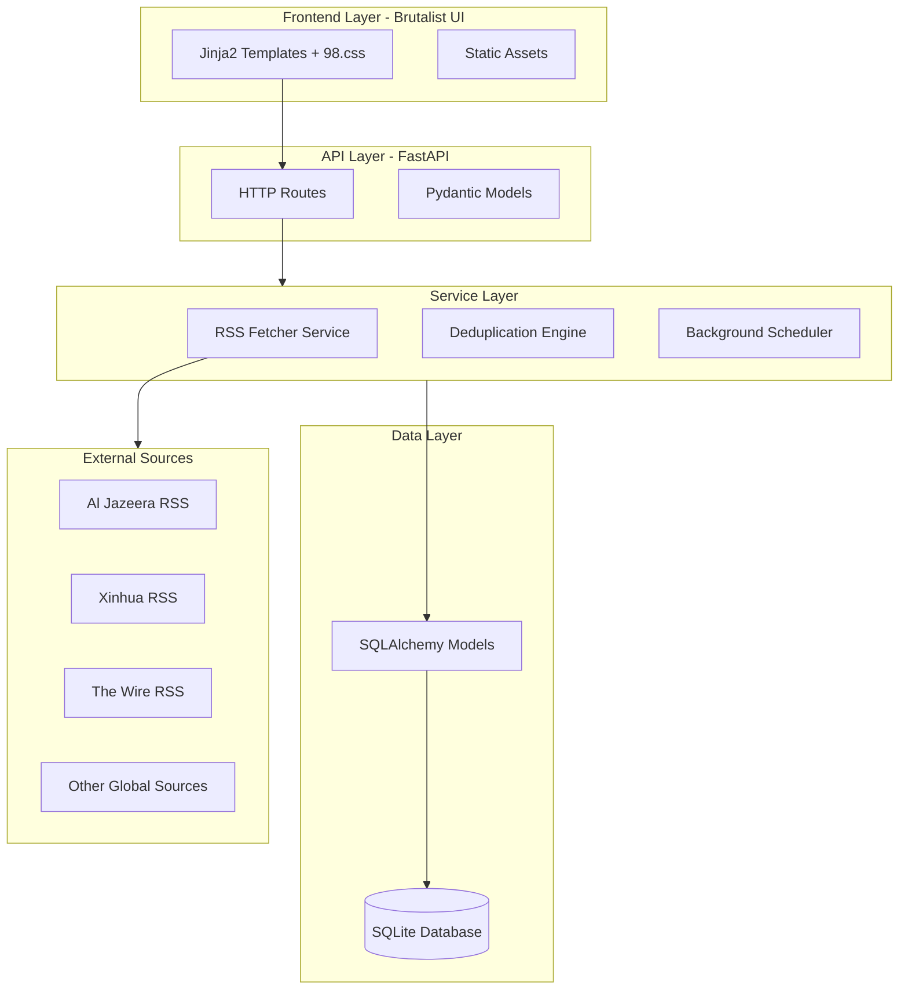
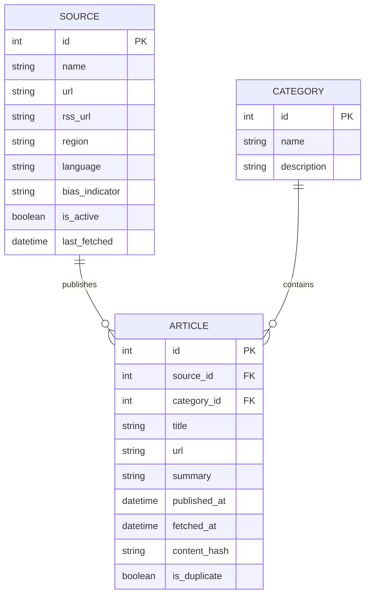

# RetroAgg - Vibe-Coded News Aggregator Architecture

## Overview
A late 90s brutalist-style news aggregator prioritizing information pluralism and breaking content bubbles through diverse global sources.

## Core Philosophy
- **Digital Brutalism**: Raw, unstyled HTML, high contrast, utilitarian design
- **Information Pluralism**: Prioritizing non-Western and underrepresented perspectives
- **Functional Simplicity**: Maximum information density, minimal cognitive load
- **Anti-Algorithmic**: No personalization, chronological feeds only

## Technology Stack

| Component | Technology | Rationale |
|-----------|-----------|-----------|
| Backend | FastAPI (Python) | Async, modern, type hints, auto-docs |
| Database | SQLite | Zero-config, single file, perfect for MVP |
| ORM | SQLAlchemy | Mature, flexible, migration support |
| RSS Parsing | feedparser + httpx | Robust feed handling with async HTTP |
| Frontend | Jinja2 + 98.css | Server-rendered, authentic retro aesthetic |
| Scheduling | APScheduler | Background feed fetching |
| Templating | Jinja2 | Fast, flexible, well-integrated with FastAPI |

## System Architecture



## Database Schema



## Directory Structure

```
retroagg/
├── app/
│   ├── __init__.py
│   ├── main.py                 # FastAPI application entry point
│   ├── config.py               # Configuration settings
│   ├── database.py             # Database connection & session management
│   ├── models/
│   │   ├── __init__.py
│   │   ├── source.py           # Source model
│   │   ├── article.py          # Article model
│   │   └── category.py         # Category model
│   ├── services/
│   │   ├── __init__.py
│   │   ├── rss_fetcher.py      # RSS feed fetching logic
│   │   └── deduplicator.py     # Article deduplication
│   ├── routers/
│   │   ├── __init__.py
│   │   ├── pages.py            # HTML page routes
│   │   └── api.py              # JSON API routes
│   ├── schemas/
│   │   ├── __init__.py
│   │   ├── article.py          # Pydantic schemas
│   │   └── source.py
│   ├── static/
│   │   └── css/
│   │       └── custom.css      # Additional brutalist styles
│   └── templates/
│       ├── base.html           # Base template with 98.css
│       ├── index.html          # Main feed view
│       └── sources.html        # Sources list
├── data/
│   └── retroagg.db             # SQLite database
├── requirements.txt
└── README.md
```

## Source Registry (Diverse Global Sources)

| Source | Region | Language | RSS URL |
|--------|--------|----------|---------|
| Al Jazeera | MENA | English | https://www.aljazeera.com/xml/rss/all.xml |
| Xinhua | Asia | English | http://www.xinhuanet.com/english/rss/worldrss.xml |
| The Wire | South Asia | English | https://thewire.in/rss |
| Kyodo News | Asia | English | https://english.kyodonews.net/rss/news.xml |
| Africa News Agency | Africa | English | RSS available |
| Inter Press Service | Global South | English | https://www.ipsnews.net/news/feed/ |
| South China Morning Post | Asia | English | https://www.scmp.com/rss/91/feed |
| Reuters | Global | English | http://feeds.reuters.com/reuters/topNews |
| Haaretz | MENA | English | https://www.haaretz.com/cmlink/1.1617539 |
| Global Voices | Global | English | https://globalvoices.org/feed |

## Key Features

### 1. RSS Aggregation
- Async fetching from multiple sources
- Background scheduling (every 15 minutes)
- Error handling and retry logic
- Source health monitoring

### 2. Deduplication Engine
- Content hash-based duplicate detection
- Headline similarity matching (70% threshold)
- URL normalization

### 3. Brutalist Frontend
- 98.css for authentic Windows 98 aesthetic
- High information density layout
- No images, text-only approach
- Monochrome or clashing primary colors
- System fonts only (Arial, Times, Courier)

### 4. Filtering & Organization
- Filter by geographic region
- Filter by source
- Chronological ordering (newest first)
- No algorithmic sorting

## API Endpoints

| Method | Path | Description |
|--------|------|-------------|
| GET | / | Main page with article feed |
| GET | /sources | List all configured sources |
| GET | /api/articles | JSON API for articles (with filters) |
| POST | /api/refresh | Trigger manual feed refresh |
| GET | /api/stats | Basic statistics |

## UI Design Principles

### Color Palette
- Background: `#c0c0c0` (Classic Win98 grey)
- Text: `#000000` (Black)
- Links: `#0000ff` (Blue), `#800080` (Purple visited)
- Borders: 3D inset/outset effects

### Typography
- System fonts only
- No external font calls
- Bold headers sparingly used
- Underlined links

### Layout
- Table-based visual structure
- Minimal padding/margins
- Window-style containers
- Status bar at bottom

## Future Enhancements (Post-MVP)

1. **AI-Powered Extraction**: ScrapeGraphAI for sites without RSS
2. **Vector Search**: Redis 8 with embeddings for semantic search
3. **Summarization**: LLM integration for article summaries
4. **Sentiment Analysis**: Flag high-arousal negative content
5. **ActivityPub/Fediverse**: Decentralized protocol support
6. **Nostr Integration**: Censorship-resistant relay support
7. **Proxy Layer**: Geo-unblocking infrastructure

## Legal/Ethical Considerations

- Only headlines and summaries (Fair Use)
- Link to original sources
- Respect robots.txt
- No user tracking
- Transparent source attribution
- No algorithmic profiling
